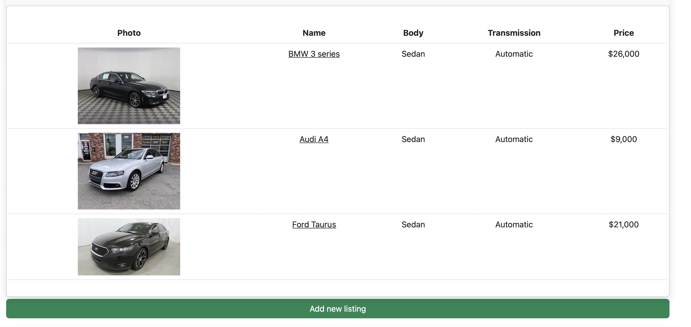
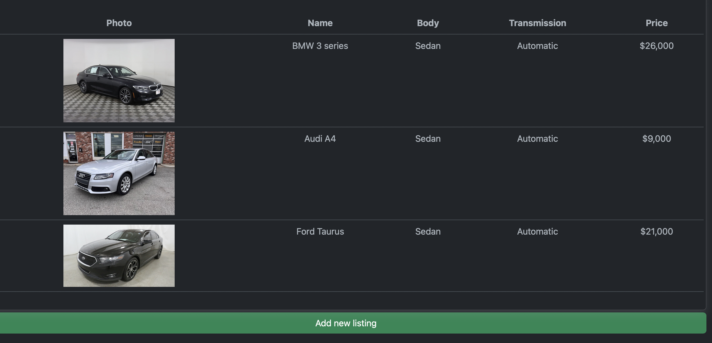
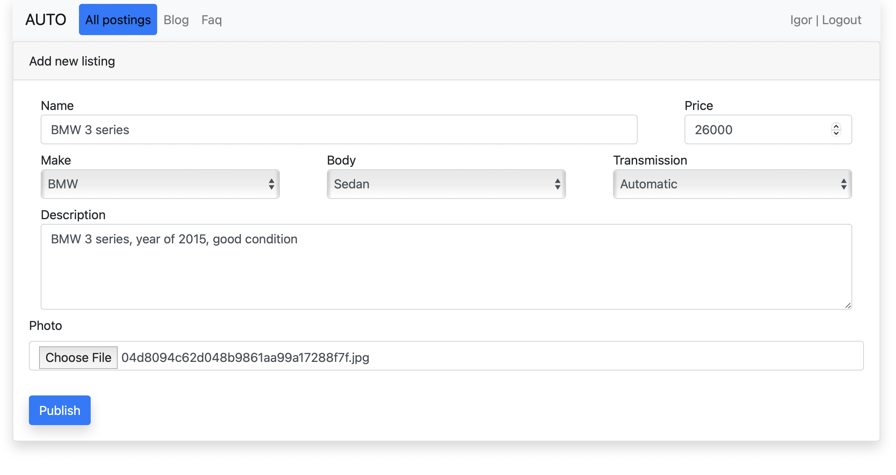
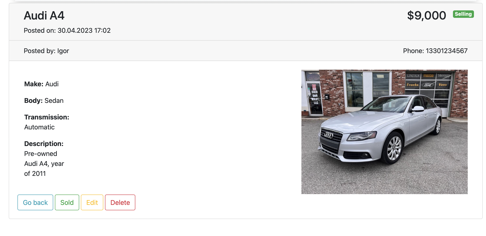

# Car trading

## About

#### Description
Web-app for posting car sales listings.

#### Technologies used
> Java, Spring boot, Maven, PostgreSQL, Hibernate, HQL, JS, HTML, BOOTSTRAP, JQuery, CSS

## Usage

Main page consists of current listings:

Dark theme is available:

Users can add new listing:

If you click on image you can see the full info about the listing

User who posted the listing can edit it

### Authors:
Igor Suvorov, Joshua Boggs, Devin Ellis